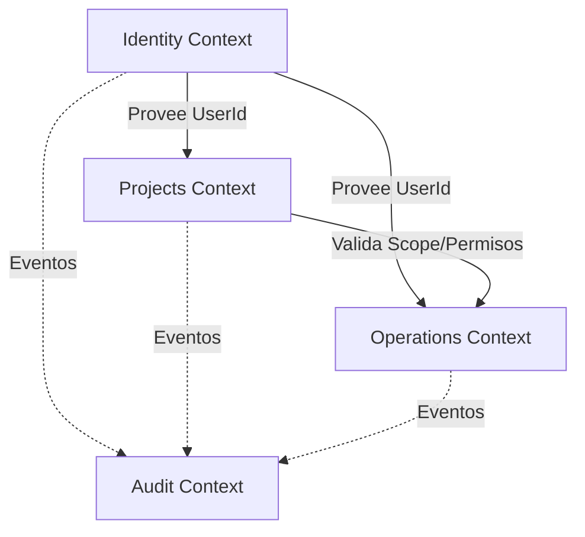

# Backend Structure Proposal

Objetivo: estructura monolito modular con limites por contexto y lista para extraer microservicios (module-first).

## Estructura

- `apps/backend/`
- `apps/backend/src/`
- `apps/backend/src/app/`
- `apps/backend/src/database/`
- `apps/backend/src/modules/`
- `apps/backend/src/shared/`

## Database

- `migrations/`
- `seeds/`

## Módulos (Bounded Contexts)

Cada módulo es autocontenido y puede extraerse a microservicio:

- `apps/backend/src/modules/identity/`
- `apps/backend/src/modules/projects/`
- `apps/backend/src/modules/operations/`
- `apps/backend/src/modules/audit/`

## Mapa de Contextos Delimitados (Bounded Context Map)

### 1. Identity & Access (Upstream)

- **Role:** Proveedor de Identidad (IdP) y Autenticación.
- **Relación:** Open Host Service (OHS) para los demás contextos.
- **Dato Compartido:** `UserId` (sólo el ID, no la entidad completa).

### 2. Projects & Resources (Core Domain)

- **Role:** Gestión de la estructura organizativa (Proyectos, Módulos, Equipos, Permisos).
- **Relación:**
  - **Downstream** de Identity (consume `UserId`).
  - **Upstream** de Operations (provee reglas de validación de Scope/Permisos).

### 3. Operations & Executions (Generic Subdomain)

- **Role:** Orquestación de ejecuciones de herramientas.
- **Relación:**
  - **Downstream** de Projects (necesita validar si el usuario tiene permiso en el Scope).
  - **Customer/Supplier:** Solicita validación de permisos a Projects.

### 4. Audit (Supporting Subdomain)

- **Role:** Registro inmutable de eventos.
- **Relación:**
  - **Downstream** de todos (Consumer de eventos de dominio).
  - No tiene lógica de negocio compleja, solo ingesta y consulta.

### Diagrama Conceptual

## Estructura interna por modulo

- `domain/`
- `application/`
- `infrastructure/`
- `infrastructure/http/`- `infrastructure/http/`

Ejemplo:

- `apps/backend/src/modules/identity/domain/`
- `apps/backend/src/modules/identity/application/`
- `apps/backend/src/modules/identity/infrastructure/`
- `apps/backend/src/modules/identity/infrastructure/http/`

## Shared Kernel

- `apps/backend/src/shared/` para:
  - tipos comunes (ids, result, errors)
  - utilidades puras (sin dependencias)
  - contratos de eventos

## Reglas para extraer microservicios

- No imports directos entre m�dulos. Comunicar via eventos o puertos.
- Un modulo solo conoce interfaces externas, no implementaciones de otros m�dulos.
- Infraestructura de cada modulo vive dentro del modulo.
- Configuracion/bootstrapping en `src/main`.

## Beneficios

- Permite separar un modulo copiando su carpeta a un repo dedicado.
- Minimiza dependencias cruzadas.
- Facilita ownership por equipo.

## Mapa de eventos

Ver docs/operations.md (Event Map).
