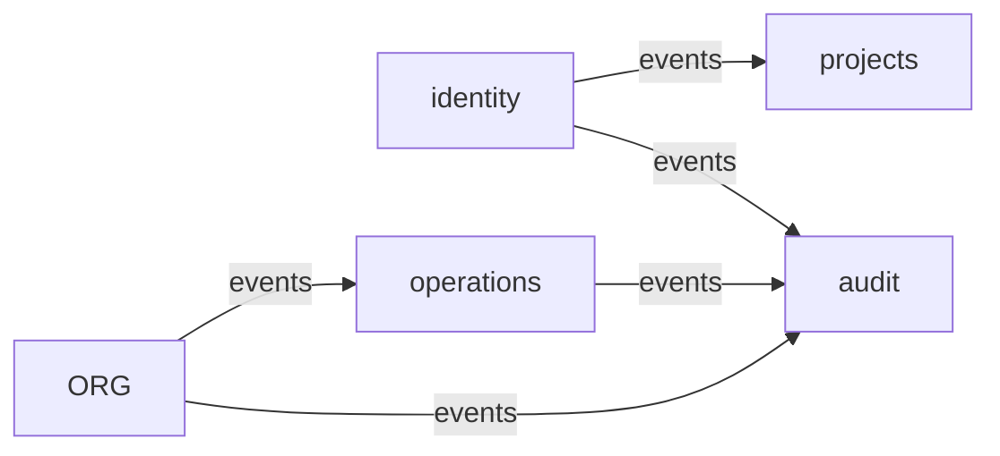

# Operations

## Event Map

## Events by Module

### identity

- Publica: `user.created`, `role.assigned`, `role.revoked`, `permission.assigned`, `permission.revoked`
- Consume: ninguno

### projects

- Publica: `projects.created`, `project.created`, `module.created`, `team.created`
- Consume: `user.created`

### operations

- Publica: `request.created`, `request.approved`, `request.rejected`, `request.executed`
- Consume: `permission.assigned`, `role.assigned`, `project.created`, `module.created`

### audit

- Publica: `audit.logged`
- Consume: todos los eventos de negocio

